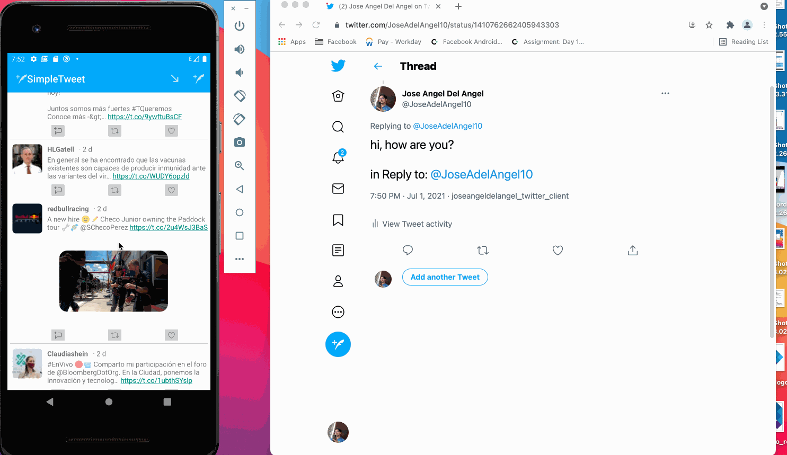

# Project 3 - *SimpleTweet*

**Simple tweet** is an app that using the [Twitter API](https://developer.twitter.com/en/docs/twitter-api/early-access) serves a Twitter client that makes GET and POST requests, in particular SimpleTweet shows the user a simplified version of his Twitter timeline and allows him to compose and reply a Tweet.

This app was developed using the Twitter API [https://developer.twitter.com/en/docs/twitter-api/early-access](https://developer.twitter.com/en/docs/twitter-api/early-access)

Submitted by: **Jose Angel Del Angel**

Time spent: **24** hours spent in total

## User Stories

The following **required** functionality is completed:
1. User can sign in to Twitter using OAuth login 🖥️

2. User can view the tweets from their home timeline eyes

3. User can Logout 🚪

4. User can compose a new tweet ✉️

5. User can pull to refresh, view character count and embed images ✨
* [x] User can sign in to Twitter using OAuth login
* [x] User can view the tweets from their home timeline eyes
* [x] User can Logout 
* [x] User can compose a new tweet
* [x] User can pull to refresh, view character count and embed images

The following **bonus** features are implemented:

* [x] Improve the user interface and theme the app to feel "twitter branded" with colors and styles (1 to 5 points)
* [x] When any background or network task is happening, user sees an indeterminate progress indicator (1 point)
* [x] User can "reply" to any tweet from their home timeline (1 point)
* [] User can click on a tweet to be taken to a "detail view" of that tweet (2 points)
* [] User can take favorite (and unfavorite) or reweet actions on a tweet
* [x] User can view more tweets as they scroll with Endless Scrolling. Number of tweets is unlimited. (2 points)
* [] Compose activity is replaced with a modal overlay (2 points)
* [x] Links in tweets are clickable and will launch the web browser (see autolink) (1 point)
* [x] Replace all icon drawables and other static image assets with vector drawables where appropriate. (1 point)
* [] User can view following / followers list through any profile they view. (2 points)
* [] Apply the View Binding library to reduce view boilerplate. (1 point)
* [] Experiment with fancy scrolling effects on the Twitter profile view. (2 points)
* [x] User can open the twitter app offline and see last loaded tweets persisted into SQLite (2 points)

None **additional features** were implemented

## Video Walkthrough

Here are walkthroughs of implemented user stories:

GIF created with [LiceCap](https://www.cockos.com/licecap/).

## Challenges when developing the app

## License

    Copyright 2021 Jose Angel Del Angel Dominguez

    Licensed under the Apache License, Version 2.0 (the "License");
    you may not use this file except in compliance with the License.
    You may obtain a copy of the License at

        http://www.apache.org/licenses/LICENSE-2.0

    Unless required by applicable law or agreed to in writing, software
    distributed under the License is distributed on an "AS IS" BASIS,
    WITHOUT WARRANTIES OR CONDITIONS OF ANY KIND, either express or implied.
    See the License for the specific language governing permissions and
    limitations under the License.
